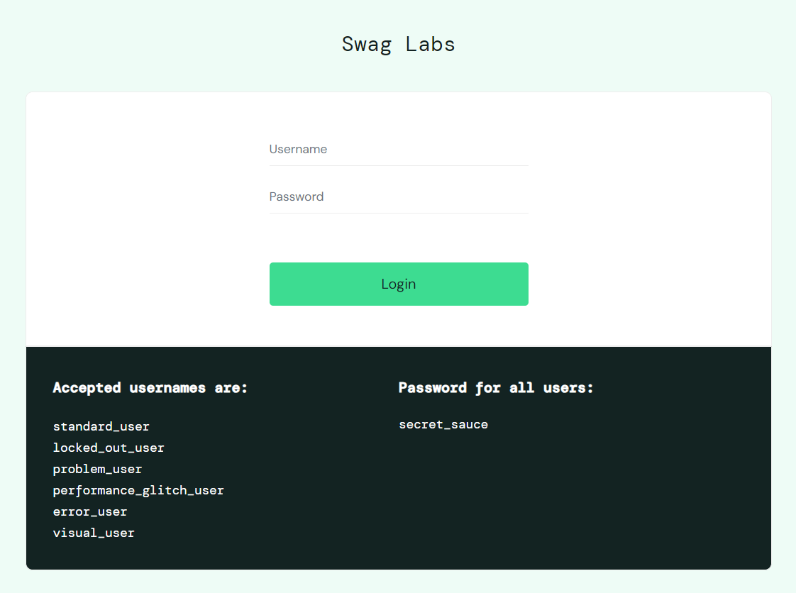

# Portfólio
Este projeto tem como finalidade de mostrar o meu trabalho de análise de requisitos e plano de teste.

Neste repositório você irá encontrar a análise de dois (2) projetos, sendo um:

- Análise de requisitos de um protótipo Figma 
- Plano de Teste de um site

## Portfólio Análise de Requisitos

- Protótipo do Figman [PodcastApp](https://search.muz.li/NDJlOWNhZTNj)
  

## Portfólio Plano de Teste

- Site utilizado para elaboração do Plano de Teste [Saucedemo](https://www.saucedemo.com)
  

