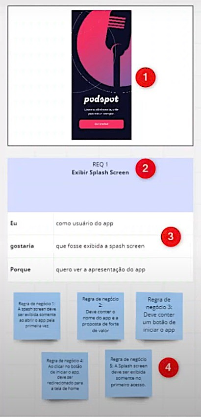

## Projeto Podcast APP

Este projeto foi criado com o propósito de práticar o **levantamento de requisito** de um projeto. Onde foi levado em consideração analisar um projeto do tipo Figma retirado do site Muzli onde vários designer tem a possibilidade de subir os seus projetos. Com isso, irei demonstrar a análise do projeto PodcastApp onde através do protótipo irei analisar os requisitos desejáveis para este projeto.

## Protótipo
- Protótipo do Figman [PodcastApp](https://search.muz.li/NDJlOWNhZTNj)
  

## Análise do projeto
A imagem abaixo irá indicar como foi feita a análise deste projeto, onde foi utilizado o **MIRO** para fazer a análise de forma visual.

1. Indicação da imagem a ser analisada
2. Indicação de qual requerimento iremos analisar, indicando seu número e nome 
3. Descrição em alto da funcionalidade, indicando o usuário que irá utilizar, a funcionalidade desejada e o porque da existência desta funcionalidade.
4. Listagem das regras de negócio a serem implementadas.

### Referência da análise

- REQ 1 Exibir Splash Screen
- REQ 2 Criar padrão de Header
- REQ 3 Top 10 Podcast
- REQ 4 Exibir as categorias de Podcast
- REQ 5 Exibir as recomedações
- REQ 6 Tela inicial do Podcast
- REQ 7 Exibir a lista de todos os episódios
- REQ 8 Exibição do Player de execução do Podcast